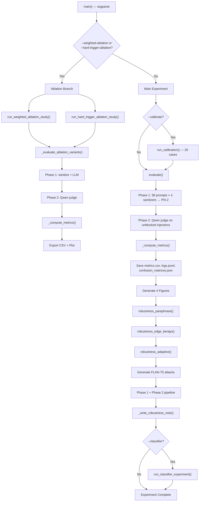
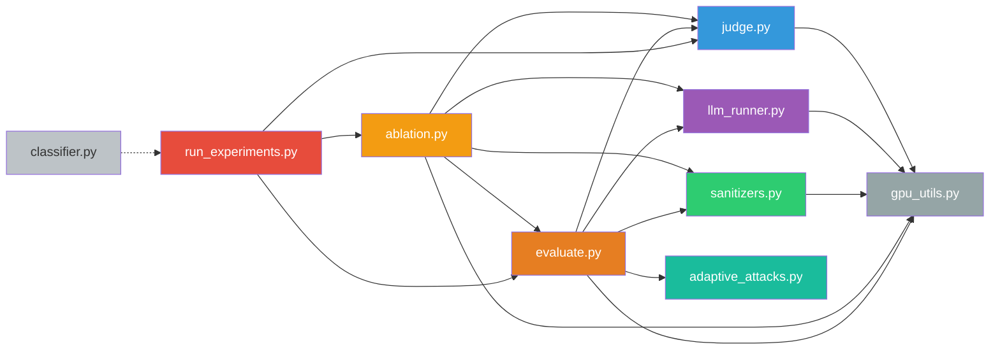

# Architecture Report — Securing LLMs

> **Generated:** 2026-07-24 · **Scope:** Full codebase analysis (read-only, no modifications)

---

## Table of Contents

1. [Project Summary](#1-project-summary)
2. [File Inventory & Line Counts](#2-file-inventory--line-counts)
3. [Execution Flow](#3-execution-flow)
4. [Dependency Graph](#4-dependency-graph)
5. [Responsibilities of Each File](#5-responsibilities-of-each-file)
6. [Files Violating Single Responsibility](#6-files-violating-single-responsibility)
7. [Duplicated Logic](#7-duplicated-logic)
8. [Large Functions](#8-large-functions)
9. [Unnecessary Coupling](#9-unnecessary-coupling)
10. [Proposed Folder Structure](#10-proposed-folder-structure)

---

## 1. Project Summary

This project evaluates four prompt-injection defense strategies for LLMs:

| Sanitizer | Type | Key Technique |
|-----------|------|---------------|
| Baseline | No defense | Pass-through |
| Regex | Rule-based | 30+ compiled patterns |
| Keyword Heuristic | Rule-based | Weighted keyword scoring |
| Context-Aware | Multi-signal (proposed) | 8 signals: regex, keyword, MiniLM embeddings, intent, roleplay, instruction-shift, objective-conflict, distilgpt2 perplexity |

The evaluation pipeline runs in two layers:
- **Layer 1 (Sanitizer):** Bypass Rate, FPR, confusion matrices
- **Layer 2 (Model):** True ASR via LLM-as-a-Judge (Qwen2.5-3B-Instruct)

---

## 2. File Inventory & Line Counts

### Source Files (`src/`)

| File | Lines | Bytes | Primary Role |
|------|------:|------:|--------------|
| `__init__.py` | 2 | 69 | Package marker |
| `sanitizers.py` | 675 | 28,226 | All 4 sanitizer classes + patterns + factory |
| `run_experiments.py` | 673 | 28,441 | CLI entrypoint + plotting + report generation |
| `evaluate.py` | 730 | 26,149 | Core evaluation pipeline + robustness tests |
| `judge.py` | 591 | 19,708 | Qwen compliance judge + calibration |
| `llm_runner.py` | 171 | 5,104 | Target LLM (Qwen2.5-3B) wrapper |
| `ablation.py` | 244 | 7,757 | Ablation study runner |
| `adaptive_attacks.py` | 254 | 5,492 | FLAN-T5 adaptive attack generator |
| `classifier.py` | 133 | 4,190 | LR + TF-IDF stretch-goal classifier |
| `gpu_utils.py` | 28 | 658 | CUDA memory helpers |
| **Total** | **3,501** | **125,794** | |

### Other Python Files

| File | Lines | Role |
|------|------:|------|
| `load_dataset.py` (root) | 20 | Standalone train/val/test loader utility |

### Non-Code Assets

| Directory | Contents |
|-----------|----------|
| `data/raw/` | 5 raw dataset files (CSVs, JSONLs) |
| `data/cleaned/` | 11 cleaned/curated dataset files |
| `data/splits/` | `train.csv`, `val.csv`, `test.csv` + `split.ipynb` |
| `data_cards/` | `Data_Card.md`, `license_log.txt` |
| `notebooks/` | 7 Jupyter notebooks (EDA, preprocessing, experiments) |
| `results/` | 23 output files (CSVs, JSONLs, PNGs, JSONs, TXT) |
| `results/figures/` | 9 chart PNGs |

---

## 3. Execution Flow

### 3.1 Primary CLI Pipeline (`python -m src.run_experiments`)



### 3.2 Two-Phase Memory Management

```
┌───────────────────────────────────────────────────────┐
│ Phase 1 — Models in RAM:                              │
│   • MiniLM (sentence-transformers, ~80 MB)            │
│   • distilgpt2 (perplexity, ~340 MB)                  │
│   • Qwen2.5-3B-Instruct (target LLM, ~5.5 GB)        │
│                                                       │
│   For each prompt × sanitizer:                        │
│     sanitize() → run() if not blocked                 │
└───────────────────────┬───────────────────────────────┘
                        │ release MiniLM, distilgpt2,
                        │ release target LLM
                        │ empty_cuda_cache()
                        ▼
┌───────────────────────────────────────────────────────┐
│ Phase 2 — Models in RAM:                              │
│   • Qwen2.5-3B-Instruct (judge)                      │
│                                                       │
│   For each unblocked injection:                       │
│     judge.evaluate(original_prompt, llm_output)       │
│     → COMPLIED / REFUSED                              │
└───────────────────────────────────────────────────────┘
```

### 3.3 Sanitizer Signal Flow (Context-Aware)

```
Input Prompt
    │
    ├──→ _regex_signal()           → 0.0 | 1.0     × 0.12
    ├──→ _keyword_signal()         → [0.0, 1.0]    × 0.12
    ├──→ _semantic_signal()        → 0.0|0.5|0.7|1  × 0.20  (MiniLM cosine sim)
    ├──→ _intent_signal()          → 0.0 | 1.0     × 0.18
    ├──→ _roleplay_signal()        → 0.0 | 1.0     × 0.10
    ├──→ _instruction_shift_signal() → 0.0 | 1.0   × 0.08
    ├──→ _objective_conflict_signal() → 0.0 | 1.0  × 0.08
    └──→ _perplexity_signal()      → [0.0, 1.0]    × 0.12
                                    ─────────────────────
                            total = Σ(w_i × signal_i)

    Hard Triggers (bypass soft threshold):
        semantic > 0.6         → BLOCK
        intent == 1.0          → BLOCK
        roleplay + keyword>0.3 → BLOCK

    Soft Threshold:
        total >= 0.40          → BLOCK
```

---

## 4. Dependency Graph

### 4.1 Inter-Module Dependencies



### 4.2 External Dependency Map

| Module | External Deps |
|--------|---------------|
| `sanitizers.py` | `re`, `os`, `pandas`, `numpy`, `sentence_transformers`, `transformers`, `torch` |
| `evaluate.py` | `os`, `json`, `random`, `numpy`, `pandas`, `tqdm`, `sklearn.metrics` |
| `run_experiments.py` | `os`, `sys`, `json`, `argparse`, `numpy`, `pandas`, `matplotlib`, `pathlib` |
| `judge.py` | `os`, `re`, `warnings`, `transformers`, `torch` |
| `llm_runner.py` | `os`, `warnings`, `transformers`, `torch` |
| `adaptive_attacks.py` | `os`, `warnings`, `transformers` |
| `classifier.py` | `os`, `numpy`, `pandas`, `sklearn` |
| `ablation.py` | `os`, `pandas`, `tqdm` |
| `gpu_utils.py` | `gc`, `torch` |
| `load_dataset.py` | `os`, `pandas` |

### 4.3 Import Hierarchy (Layered View)

```
Layer 0 (no internal deps):   gpu_utils.py, classifier.py, adaptive_attacks.py
Layer 1 (deps on Layer 0):    sanitizers.py → gpu_utils
                               llm_runner.py → gpu_utils
                               judge.py → gpu_utils
Layer 2 (deps on Layer 1):    evaluate.py → sanitizers, llm_runner, judge, gpu_utils, adaptive_attacks
Layer 3 (deps on Layer 2):    ablation.py → evaluate, sanitizers, llm_runner, judge, gpu_utils
Layer 4 (deps on Layer 3):    run_experiments.py → evaluate, ablation, judge
```

---

## 5. Responsibilities of Each File

### `src/sanitizers.py` (675 lines)
- Defines all 4 sanitizer classes: `BaselineSanitizer`, `RegexSanitizer`, `KeywordHeuristicSanitizer`, `ContextAwareSanitizer`
- Stores all regex patterns (`REGEX_PATTERNS`, `INTENT_PATTERNS`, `_SHIFT_PATTERNS`, `_ROLEPLAY_PATTERNS`, `_MASKED_PATTERNS`, `_CONFLICT_PATTERNS`) as module-level constants
- Stores keyword weights dictionary (`KEYWORD_WEIGHTS`)
- Stores signal weights (`W1`–`W8`) and thresholds
- Manages MiniLM embedding model lifecycle (load, encode, release)
- Manages distilgpt2 perplexity model lifecycle (load, calibrate, release)
- Provides factory function `get_all_sanitizers()`

### `src/evaluate.py` (730 lines)
- Core evaluation function `evaluate()` — the two-phase pipeline
- Single-sanitizer evaluation `evaluate_sanitizer()`
- Metrics computation `_compute_metrics()` — Bypass Rate, True ASR, FPR, confusion matrices
- Paraphrase robustness test `robustness_paraphrase()`
- Edge benign robustness test `robustness_edge_benign()`
- Adaptive attack robustness test `robustness_adaptive()`
- Stores 72 hard-coded edge-benign test prompts (`EDGE_BENIGN_PROMPTS`)
- Stores paraphrase substitution pairs (`PARAPHRASE_SUBS`)
- Helper functions: `_paraphrase()`, `_attack_success()`

### `src/run_experiments.py` (673 lines)
- CLI argument parsing (`main()`)
- Orchestrates all experiment phases (main eval, robustness, ablation, classifier)
- 7 matplotlib plotting functions
- Robustness note generation `_write_robustness_note()`
- Color/label mapping constants (`METHOD_COLORS`, `METHOD_LABELS`)
- Results I/O (CSV, JSONL, JSON, PNG, TXT)
- `_banner()` formatting helper

### `src/judge.py` (591 lines)
- `ComplianceJudge` class wrapping Qwen2.5-3B-Instruct
- ~230-line system prompt (`JUDGE_SYSTEM_PROMPT`)
- 20 calibration cases (`CALIBRATION_CASES`)
- Judge output parsing (`parse_judge_output()`, `_extract_reasoning()`)
- Device resolution logic (`_resolve_judge_device()`)
- Model loading (`_load_judge_pipeline()`) and release (`release_judge()`)
- Calibration runner (`run_calibration()`)

### `src/llm_runner.py` (171 lines)
- `LLMRunner` class wrapping Qwen2.5-3B-Instruct as the target model
- Model loading (`_load_model()`) and release (`release_model()`)
- Mock/fallback support via `SKIP_LLM` env var
- Warning suppression boilerplate

### `src/adaptive_attacks.py` (254 lines)
- `CustomGenerator` class wrapping FLAN-T5-Base for text generation
- Lazy model loading (`_load_generator()`) and release (`release_generator()`)
- 5 attack style templates (`STYLE_PROMPTS`)
- Attack generation API (`generate_attack()`, `generate_adaptive_variants()`)

### `src/ablation.py` (244 lines)
- Ablation variant definitions (`WEIGHTED_ABLATION_VARIANTS`, `HARD_TRIGGER_ABLATION_VARIANTS`)
- Core ablation engine `_evaluate_ablation_variants()` — shared model loading, Phase 1 + Phase 2
- Public API: `run_weighted_ablation_study()`, `run_hard_trigger_ablation_study()`

### `src/classifier.py` (133 lines)
- `InjectionClassifier` class — TF-IDF vectorizer + Logistic Regression
- Train/evaluate/predict methods
- `run_classifier_experiment()` convenience runner

### `src/gpu_utils.py` (28 lines)
- `empty_cuda_cache()` — GC + CUDA synchronize + cache clear
- `cuda_free_gb()` — query free GPU memory

### `load_dataset.py` (root, 20 lines)
- `load_splits()` — convenience loader for train/val/test DataFrames
- Standalone utility (not imported by `src/` modules)

---

## 6. Files Violating Single Responsibility

### 🔴 `evaluate.py` — 4+ distinct responsibilities

| Responsibility | Lines | Should Be |
|---------------|------:|-----------|
| Main evaluation pipeline (`evaluate()`) | ~115 | `evaluate.py` |
| Single-sanitizer evaluation (`evaluate_sanitizer()`) | ~110 | `evaluate.py` |
| Metrics computation (`_compute_metrics()`) | ~76 | `metrics.py` |
| Paraphrase robustness (`robustness_paraphrase()`) | ~40 | `robustness.py` |
| Edge benign robustness (`robustness_edge_benign()`) | ~26 | `robustness.py` |
| Adaptive robustness (`robustness_adaptive()`) | ~150 | `robustness.py` |
| 72 hardcoded edge-benign prompts | ~100 | `test_data/edge_prompts.json` |
| Paraphrase substitution data | ~15 | `test_data/paraphrase_subs.json` |

**Verdict:** This file is the worst offender. It mixes evaluation logic, robustness testing, test data constants, and metrics computation into one 730-line monolith.

---

### 🔴 `run_experiments.py` — 3+ distinct responsibilities

| Responsibility | Lines | Should Be |
|---------------|------:|-----------|
| CLI argument parsing + orchestration | ~200 | `run_experiments.py` (keep) |
| 7 plotting functions | ~250 | `plotting.py` |
| Robustness note generation | ~115 | `reporting.py` |
| Display constants (colors, labels) | ~15 | `plotting.py` |

**Verdict:** Plotting and report generation should be extracted. The CLI orchestrator should remain lean.

---

### 🟡 `sanitizers.py` — 2 responsibilities (borderline)

| Responsibility | Lines | Should Be |
|---------------|------:|-----------|
| 4 sanitizer classes + logic | ~550 | `sanitizers.py` (keep) |
| Pattern/weight constants (~100 lines of regex strings) | ~100 | `patterns.py` or config file |
| ML model lifecycle (MiniLM, distilgpt2) | ~130 | Part of `ContextAwareSanitizer` (acceptable) |

**Verdict:** The regex patterns and keyword weights are data, not logic. Externalizing them would improve maintainability. The ML model lifecycle is tightly coupled to the sanitizer and is acceptable as-is.

---

### 🟡 `judge.py` — 2 responsibilities

| Responsibility | Lines | Should Be |
|---------------|------:|-----------|
| Judge class + model lifecycle | ~200 | `judge.py` (keep) |
| 230-line system prompt + 20 calibration cases (~250 lines of static data) | ~350 | `prompts/judge_system.txt` + `test_data/calibration.json` |

**Verdict:** Over half the file is static data (prompt text + calibration cases). Extracting these would make the actual judge logic much clearer.

---

## 7. Duplicated Logic

### 🔴 DUP-1: Phase 1 + Phase 2 Pipeline (Critical — 3 near-identical copies)

The two-phase "sanitize → LLM → collect pending → judge" pattern is duplicated in **three** locations:

| Location | Function | Lines |
|----------|----------|------:|
| `evaluate.py` | `evaluate()` | L194–L308 (~115 lines) |
| `evaluate.py` | `evaluate_sanitizer()` | L311–L419 (~108 lines) |
| `evaluate.py` | `robustness_adaptive()` | L552–L702 (~150 lines) |
| `ablation.py` | `_evaluate_ablation_variants()` | L73–L209 (~137 lines) |

All four functions share this identical structure:

```python
records = []
pending_judge = []

# Phase 1
for prompt in test_data:
    for sanitizer in sanitizers:
        sanitized, blocked = sanitizer.sanitize(prompt)
        if blocked:
            llm_output = "[BLOCKED]"
            judge_label = "BLOCKED"
        elif runner:
            llm_output = runner.run(sanitized)
            if label == "injection" and not skip_judge:
                judge_label = None  # deferred
            # ...
        records.append(rec)
        if judge_label is None:
            pending_judge.append(len(records) - 1)

# Phase 2
if pending_judge and not skip_judge:
    # release sanitizer models + target LLM
    # load judge
    for idx in pending_judge:
        rec = records[idx]
        label, reasoning = judge.evaluate(...)
        rec["judge_label"] = label
        rec["attack_success"] = _attack_success(...)
    judge.release()
```

**Impact:** Any change to the record schema, judge integration, or memory management must be replicated in 3–4 places. This is the single biggest maintenance risk.

**Fix:** Extract a generic `run_pipeline(prompts, sanitizers, runner, judge_enabled) → logs_df` function and have all four call sites use it.

---

### 🟡 DUP-2: `skip_judge` Resolution (4 copies)

The same 5-line pattern appears in 4 places:

```python
skip_judge = (
    os.environ.get("SKIP_JUDGE", "0").strip() == "1"
    or not use_llm
    or runner is None
    or runner.is_mock()
)
```

| Location | Line |
|----------|-----:|
| `evaluate.py:evaluate()` | L215–L220 |
| `evaluate.py:evaluate_sanitizer()` | L325–L330 |
| `evaluate.py:robustness_adaptive()` | L577–L582 |
| `ablation.py:_evaluate_ablation_variants()` | L97–L102 |

**Fix:** Extract to a utility function `should_skip_judge(use_llm, runner) → bool`.

---

### 🟡 DUP-3: Model Release + Cache Clear Pattern (5+ copies)

```python
if hasattr(san, "release_models"):
    san.release_models()
if runner:
    runner.release()
empty_cuda_cache()
```

This exact sequence appears in `evaluate()`, `evaluate_sanitizer()`, `robustness_adaptive()`, and `_evaluate_ablation_variants()`.

---

### 🟡 DUP-4: Model Loading Boilerplate (`llm_runner.py` vs `judge.py`)

Both files independently implement the same pattern:
- Module-level `_pipeline = None`
- `_load_*()` function with global state
- `release_*()` function with `del` + `empty_cuda_cache()`
- Class wrapper with `.mock` fallback and `.release()` delegation

The `LLMRunner` and `ComplianceJudge` classes follow an identical structural pattern with different model names.

---

### 🟢 DUP-5: Path Constants (Minor)

`_ROOT`, `TEST_CSV`, `TRAIN_CSV` are defined independently in:
- `evaluate.py` (L42–L44)
- `run_experiments.py` (L48–L53)
- `classifier.py` (L22–L25)
- `ablation.py` imports from `evaluate.py` (correct)

**Fix:** Define once in `__init__.py` or a `config.py`.

---

### 🟢 DUP-6: Regex Pattern Overlap (`sanitizers.py`)

Several patterns in `REGEX_PATTERNS` overlap with `INTENT_PATTERNS` and `_ROLEPLAY_PATTERNS`:

| Duplicated Pattern | In `REGEX_PATTERNS` | In `INTENT_PATTERNS` | In `_ROLEPLAY_PATTERNS` |
|--------------------|:---:|:---:|:---:|
| `act\s+as` | ✓ | ✓ | ✗ |
| `pretend\s+to\s+be` | ✓ | ✓ | ✓ |
| `you\s+are\s+now` | ✓ | ✗ | ✗ |
| `from\s+now\s+on` | ✓ | ✓ | ✗ |
| `forget/disregard/ignore` | ✓ | ✓ | ✗ |
| `DAN/BOB/STAN/LUCIFER` | ✓ | ✓ | ✗ |
| `developer\s*mode` | ✓ | ✓ | ✗ |
| `without\s+restrictions` | ✓ | ✓ | ✗ |

**Impact:** Intentional overlap (each pattern set serves a different signal), but maintenance confusion risk. Patterns changed in one list may not be changed in others.

---

## 8. Large Functions

Functions exceeding 40 lines (a reasonable threshold for research code):

| Function | File | Lines | Concern |
|----------|------|------:|---------|
| `robustness_adaptive()` | `evaluate.py` | ~150 | Full pipeline duplicate + attack gen orchestration |
| `_write_robustness_note()` | `run_experiments.py` | ~113 | Report generation mixed with string formatting |
| `evaluate()` | `evaluate.py` | ~115 | Phase 1 + Phase 2 in one function |
| `evaluate_sanitizer()` | `evaluate.py` | ~108 | Near-duplicate of `evaluate()` |
| `_evaluate_ablation_variants()` | `ablation.py` | ~137 | Near-duplicate of `evaluate()` |
| `_compute_metrics()` | `evaluate.py` | ~76 | Acceptable — complex metric logic |
| `main()` | `run_experiments.py` | ~210 | Long but inherently orchestrational — acceptable for CLI |
| `ContextAwareSanitizer.__init__()` | `sanitizers.py` | ~47 | Many disable flags — could use a config dataclass |
| `_init_perplexity_model()` | `sanitizers.py` | ~45 | Acceptable — model init is naturally verbose |
| `_semantic_signal()` | `sanitizers.py` | ~43 | Acceptable — well-documented mathematical logic |
| `JUDGE_SYSTEM_PROMPT` (constant) | `judge.py` | ~182 | Not a function, but a massive string constant dominating the file |

### Largest Data Constants

| Constant | File | Lines | Type |
|----------|------|------:|------|
| `JUDGE_SYSTEM_PROMPT` | `judge.py` | 182 | String |
| `EDGE_BENIGN_PROMPTS` | `evaluate.py` | 100 | List |
| `REGEX_PATTERNS` | `sanitizers.py` | 62 | List |
| `CALIBRATION_CASES` | `judge.py` | 110 | List of dicts |
| `KEYWORD_WEIGHTS` | `sanitizers.py` | 42 | Dict |
| `STYLE_PROMPTS` | `adaptive_attacks.py` | 72 | Dict |

---

## 9. Unnecessary Coupling

### 🔴 COUP-1: `evaluate.py` imports `adaptive_attacks.py` at module body level (L547)

```python
from .adaptive_attacks import (
    generate_adaptive_variants,
    release_generator,
)
```

This import sits at line 547 — *inside the module body but outside any function*. It forces FLAN-T5 dependencies to be resolved whenever `evaluate.py` is imported, even if adaptive attacks are never used. The import should be deferred to inside `robustness_adaptive()`.

---

### 🔴 COUP-2: `ablation.py` directly imports private functions from `evaluate.py`

```python
from .evaluate import (
    TEST_CSV, TRAIN_CSV,
    _attack_success,    # private function
    _compute_metrics,   # private function
)
```

`ablation.py` depends on `_attack_success()` and `_compute_metrics()` — both prefixed with `_` indicating they are internal. These should be promoted to public API or shared via a common module.

---

### 🟡 COUP-3: `ContextAwareSanitizer` internally instantiates `RegexSanitizer` and `KeywordHeuristicSanitizer`

```python
self._regex_san = RegexSanitizer()
self._kw_san = KeywordHeuristicSanitizer()
```

This creates a composition-based coupling within `sanitizers.py`. It's not harmful since all three are in the same module, but it means `ContextAwareSanitizer` cannot be used without the other two classes.

---

### 🟡 COUP-4: Global mutable state for model singletons

Both `llm_runner.py` and `judge.py` use module-level `_pipeline = None` global variables for singleton model management. This makes unit testing difficult and creates hidden state dependencies.

```python
# llm_runner.py
_pipeline = None

def _load_model():
    global _pipeline
    ...

# judge.py  
_pipeline = None

def _load_judge_pipeline():
    global _pipeline
    ...
```

---

### 🟡 COUP-5: `llm_runner.py` sets `os.environ` at import time (L24–L26)

```python
import os
os.environ.setdefault("HF_HUB_DISABLE_IMPLICIT_TOKEN", "1")
os.environ["TOKENIZERS_PARALLELISM"] = "false"
```

Similarly in `judge.py` (L31–L32). These side effects occur on import, which is unexpected. They should be moved into the loading functions.

---

### 🟡 COUP-6: Duplicate `import os` in `llm_runner.py`

Lines 14 and 24 both have `import os`. The second import on L24 shadows the first (harmless but sloppy).

---

### 🟢 COUP-7: `load_dataset.py` is orphaned

The root-level `load_dataset.py` is not imported by any `src/` module. The same split paths are hardcoded in `evaluate.py`, `classifier.py`, and `run_experiments.py`. This utility is dead code from the perspective of the experiment pipeline.

---

## 10. Proposed Folder Structure

### Current Structure (Flat)

```
Securing_LLMs/
├── src/
│   ├── __init__.py
│   ├── sanitizers.py          ← 675 lines, 4 classes + patterns + factory
│   ├── evaluate.py            ← 730 lines, eval + robustness + metrics
│   ├── run_experiments.py     ← 673 lines, CLI + plotting + reporting
│   ├── judge.py               ← 591 lines, judge + calibration data
│   ├── llm_runner.py          ← 171 lines
│   ├── adaptive_attacks.py    ← 254 lines
│   ├── ablation.py            ← 244 lines
│   ├── classifier.py          ← 133 lines
│   └── gpu_utils.py           ← 28 lines
├── load_dataset.py            ← orphaned
└── ...
```

### Proposed Structure (Modular)

```
Securing_LLMs/
├── src/
│   ├── __init__.py
│   ├── config.py                     ← [NEW] Shared paths, seeds, constants
│   │
│   ├── sanitizers/                   ← [SPLIT from sanitizers.py]
│   │   ├── __init__.py               ←   re-exports get_all_sanitizers()
│   │   ├── base.py                   ←   BaselineSanitizer
│   │   ├── regex.py                  ←   RegexSanitizer + REGEX_PATTERNS
│   │   ├── keyword.py                ←   KeywordHeuristicSanitizer + KEYWORD_WEIGHTS
│   │   ├── context_aware.py          ←   ContextAwareSanitizer (8-signal logic)
│   │   └── patterns.py               ←   All pattern lists centralized
│   │
│   ├── models/                       ← [SPLIT from llm_runner.py, judge.py]
│   │   ├── __init__.py
│   │   ├── base.py                   ←   [NEW] Abstract ModelWrapper with load/release
│   │   ├── target_llm.py             ←   LLMRunner (currently llm_runner.py)
│   │   ├── judge.py                  ←   ComplianceJudge class only
│   │   └── attack_generator.py       ←   FLAN-T5 attack generator (currently adaptive_attacks.py)
│   │
│   ├── evaluation/                   ← [SPLIT from evaluate.py]
│   │   ├── __init__.py
│   │   ├── pipeline.py               ←   [NEW] Generic two-phase pipeline function
│   │   ├── metrics.py                ←   _compute_metrics() → compute_metrics()
│   │   ├── evaluate.py               ←   evaluate(), evaluate_sanitizer()
│   │   ├── robustness.py             ←   robustness_paraphrase/edge/adaptive
│   │   └── ablation.py               ←   Ablation study runner
│   │
│   ├── visualization/                ← [SPLIT from run_experiments.py]
│   │   ├── __init__.py
│   │   ├── plots.py                  ←   All 7+ plotting functions
│   │   └── reporting.py              ←   _write_robustness_note()
│   │
│   ├── utils/                        ← [REFACTOR]
│   │   ├── __init__.py
│   │   ├── gpu.py                    ←   gpu_utils.py
│   │   └── data.py                   ←   load_splits() from load_dataset.py
│   │
│   ├── classifier.py                 ←   [KEEP] Stretch goal, standalone
│   └── run_experiments.py            ←   [SLIM DOWN] CLI orchestration only
│
├── prompts/                          ← [NEW] Externalized prompt/data constants
│   ├── judge_system_prompt.txt       ←   JUDGE_SYSTEM_PROMPT
│   └── attack_templates.json         ←   STYLE_PROMPTS
│
├── test_data/                        ← [NEW] Externalized test constants
│   ├── calibration_cases.json        ←   CALIBRATION_CASES
│   ├── edge_benign_prompts.json      ←   EDGE_BENIGN_PROMPTS
│   └── paraphrase_subs.json          ←   PARAPHRASE_SUBS
│
├── data/                             ← [KEEP]
├── data_cards/                       ← [KEEP]
├── notebooks/                        ← [KEEP]
├── results/                          ← [KEEP]
├── requirements.txt                  ← [KEEP]
└── README.md                         ← [KEEP]
```

### Key Benefits of the Proposed Structure

| Change | Benefit |
|--------|---------|
| `sanitizers/` package | Each sanitizer class is independently testable; pattern data is centralized |
| `models/base.py` | Eliminates global mutable `_pipeline` pattern with a shared abstract class |
| `evaluation/pipeline.py` | **Eliminates DUP-1** — single two-phase pipeline function used by all callers |
| `evaluation/metrics.py` | Promotes `_compute_metrics()` to public API, **fixes COUP-2** |
| `visualization/` package | Separates plotting from CLI logic, shrinks `run_experiments.py` by ~350 lines |
| `prompts/` + `test_data/` | Externalizes 400+ lines of static data from Python source files |
| `config.py` | **Eliminates DUP-5** — single source of truth for paths and seeds |
| `utils/` | Groups small utilities; integrates orphaned `load_dataset.py` |

### Migration Priority

| Priority | Action | Impact | Effort |
|----------|--------|--------|--------|
| 🔴 High | Extract generic pipeline function (`evaluation/pipeline.py`) | Eliminates 400+ lines of duplication | Medium |
| 🔴 High | Extract plotting to `visualization/plots.py` | Shrinks `run_experiments.py` by 50% | Low |
| 🟡 Medium | Centralize path constants in `config.py` | Fixes scattered `_ROOT` definitions | Low |
| 🟡 Medium | Externalize prompt/test data to JSON/TXT | Removes 400+ lines of static data from Python | Low |
| 🟡 Medium | Split `sanitizers.py` into a package | Improves testability | Medium |
| 🟢 Low | Abstract model wrapper base class | Cleaner model lifecycle, better testability | Medium |
| 🟢 Low | Delete orphaned `load_dataset.py` or integrate | Removes dead code | Trivial |

---

> **Note:** This report is based on a read-only analysis. No code was modified.
